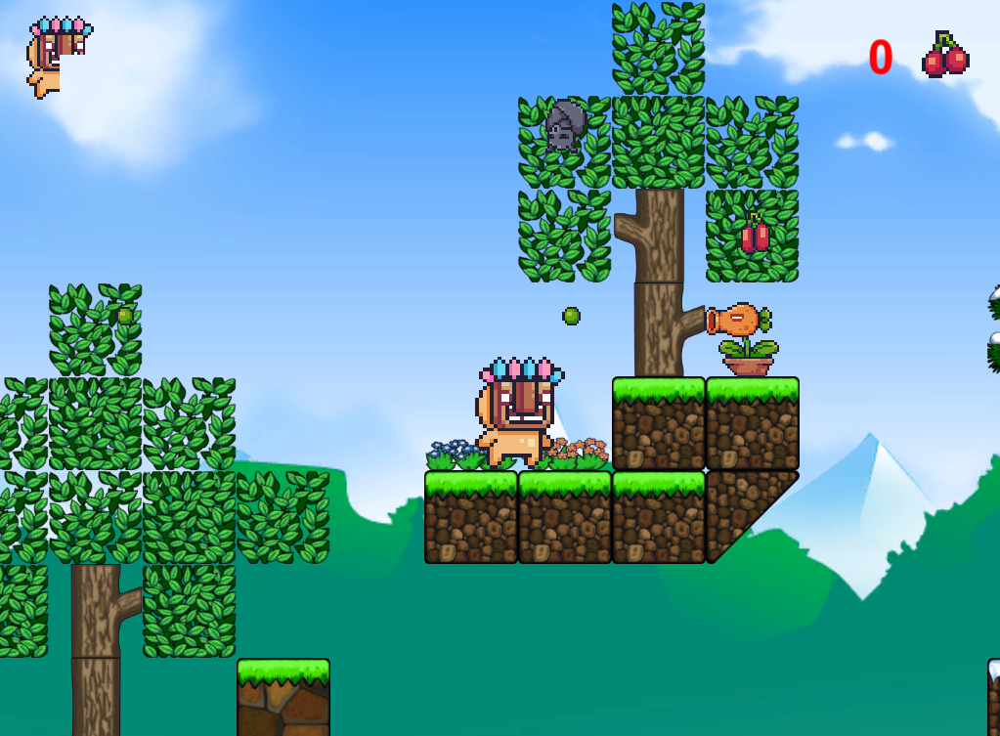

# 2DPlatform
 
 

My first ever 2D Platform game with Unity. 
Made following ElenaImagineer's YouTube tutorials. [Elena Blanes - YouTube](https://www.youtube.com/channel/UCxsrF0iBgA5HBLRHCa4lgkw)  

Unity Asset Store: 
  [Pixel Adventure 1](https://assetstore.unity.com/packages/2d/characters/pixel-adventure-1-155360) 
  [Pixel Adventure 2](https://assetstore.unity.com/packages/2d/characters/pixel-adventure-2-155418) 
  [TooCubeForest](https://assetstore.unity.com/packages/2d/environments/too-cube-forest-the-free-2d-platformer-game-tile-set-117493)   
  
  
Scripts and functionality made by me myself. 
You can play it here: [UnityPlay - 2D Platform](https://play.unity.com/mg/other/webgl-builds-73764)  

@Kevin Martínez Leiva - 2021
